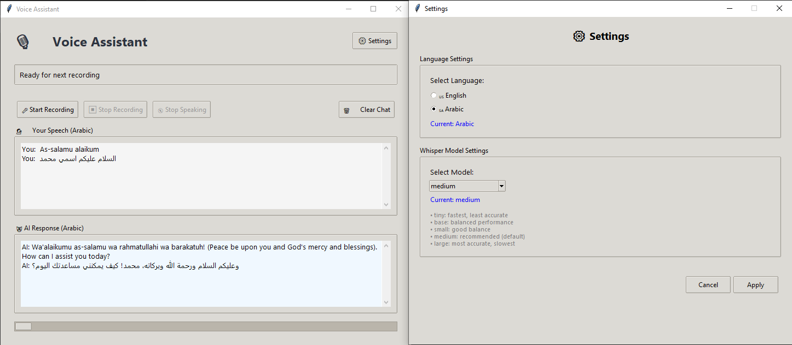

# Voice Assistant

A sophisticated voice assistant application that supports both English and Arabic languages, featuring real-time speech recognition, AI-powered responses, and natural text-to-speech capabilities.


*Modern and intuitive voice assistant interface supporting bilingual conversations*

##  Features

###  **Speech Recognition**
- **Real-time voice recording** with continuous recording capability
- **Whisper AI integration** for accurate speech-to-text conversion
- **Multi-language support** (English & Arabic)
- **Configurable model selection** (tiny, base, small, medium, large)

###  **AI Response Generation**
- **Cohere Arabic AI model** (`command-r7b-arabic-02-2025`) for intelligent responses
- **Bilingual conversation support** with language-specific optimizations
- **Context-aware responses** tailored for natural conversations
- **Smart text cleaning** for both Arabic and English outputs

###  **Text-to-Speech**
- **Google Text-to-Speech (gTTS)** integration
- **Background audio playback** with queue management
- **Cross-platform audio support** (Windows/Linux)
- **Playback controls** with stop functionality

## 🚀 Quick Start

### Prerequisites

1. **Python 3.9** installed on your system
2. **FFmpeg** for audio processing:
   - **Windows**: Download from [ffmpeg.org](https://ffmpeg.org/download.html)
   - **Linux**: `sudo apt install ffmpeg`
   - **macOS**: `brew install ffmpeg`

### Installation

1. **Clone the repository**:
   ```bash
   git clone https://github.com/yourusername/talktoai.git
   cd talktoai
   ```

2. **Install required packages**:
   ```bash
   pip install -r requirements.txt
   ```

3. **Set up your Cohere API key**:
   - Sign up at [Cohere](https://cohere.ai/)
   - Replace the API key in `talk_to_ai.py`:
     ```python
     self.co = cohere.Client("YOUR_API_KEY_HERE")
     ```

4. **Run the application**:
   ```bash
   python talk_to_ai.py
   ```

## 📋 Requirements

Create a `requirements.txt` file with the following dependencies:

```txt
cohere>=4.0.0
openai-whisper>=20231117
sounddevice>=0.4.6
numpy>=1.24.0
scipy>=1.10.0
gtts>=2.3.0
pydub>=0.25.1
```

### System Dependencies

- **FFmpeg** - Required for audio processing and playback
- **Python 3.7+** - Core runtime environment
- **Audio drivers** - System audio input/output support

## 🎯 Usage

### Basic Operation

1. **Start Recording**: Click the "🎤 Start Recording" button
2. **Speak**: Talk naturally in either English or Arabic
3. **Stop Recording**: Click "⏹ Stop Recording" when finished
4. **Get Response**: The AI will process your speech and respond
5. **Listen**: The response will be played back automatically

### Settings Configuration

Click the "⚙️ Settings" button to configure:

- **Language Selection**: Choose between English and Arabic
- **Whisper Model**: Select from tiny to large models based on your needs
  - `tiny`: Fastest, least accurate
  - `base`: Balanced performance
  - `small`: Good balance
  - `medium`: Recommended (default)
  - `large`: Most accurate, slowest

### Controls

- **🎤 Start Recording**: Begin voice input
- **⏹ Stop Recording**: End current recording
- **🔇 Stop Speaking**: Interrupt AI voice output
- **🗑️ Clear Chat**: Clear conversation history
- **⚙️ Settings**: Open configuration panel

## 🏗️ Architecture

### Core Components

```
VoiceAssistant/
├── Audio Processing
│   ├── Continuous recording with sounddevice
│   ├── Whisper model integration
│   └── FFmpeg-based playback
├── AI Integration
│   ├── Cohere Chat API
│   ├── Arabic language optimization
│   └── Response cleaning & formatting
├── User Interface
│   ├── Modern Tkinter GUI
│   ├── Threading for non-blocking operations
│   └── Real-time status updates
└── Settings Management
    ├── Language configuration
    ├── Model selection
    └── Persistent preferences
```

### Key Technologies

- **🎤 OpenAI Whisper** - State-of-the-art speech recognition
- **🤖 Cohere API** - Advanced Arabic language model
- **🔊 Google TTS** - Natural text-to-speech synthesis
- **🎨 Tkinter** - Cross-platform GUI framework
- **🔧 FFmpeg** - Audio processing and playback

## 🔧 Configuration

### API Setup

1. **Cohere API Key**:
   ```python
   self.co = cohere.Client("YOUR_COHERE_API_KEY")
   ```

2. **Model Selection**:
   ```python
   self.current_model = "medium"  # Change to preferred Whisper model
   ```

3. **Language Settings**:
   ```python
   self.current_language = "ar"  # "en" for English, "ar" for Arabic
   ```

## 🐛 Troubleshooting

### Common Issues

1. **FFmpeg Not Found**:
   - Ensure FFmpeg is installed and added to PATH
   - Test with: `ffmpeg -version`

2. **Audio Recording Issues**:
   - Check microphone permissions
   - Verify audio input device is working
   - Test with different sample rates

3. **API Connection Problems**:
   - Verify Cohere API key is valid
   - Check internet connection
   - Monitor API usage limits

4. **Language Recognition Issues**:
   - Speak clearly and at moderate pace
   - Ensure correct language is selected in settings
   - Try different Whisper models for better accuracy

## 🤝 Contributing

1. Fork the repository
2. Create a feature branch (`git checkout -b feature/amazing-feature`)
3. Commit your changes (`git commit -m 'Add amazing feature'`)
4. Push to the branch (`git push origin feature/amazing-feature`)
5. Open a Pull Request

## 📄 License

This project is licensed under the MIT License - see the [LICENSE](LICENSE) file for details.

## 🙏 Acknowledgments

- **OpenAI** for the Whisper speech recognition model
- **Cohere** for the advanced Arabic language model
- **Google** for the Text-to-Speech service
- **FFmpeg** community for audio processing capabilities

## 📞 Support

If you encounter any issues or have questions:

1. Check the [Issues](https://github.com/yourusername/talktoai/issues) page
2. Create a new issue with detailed description
3. Include system information and error messages

---

**Made with ❤️ for multilingual voice interaction**
